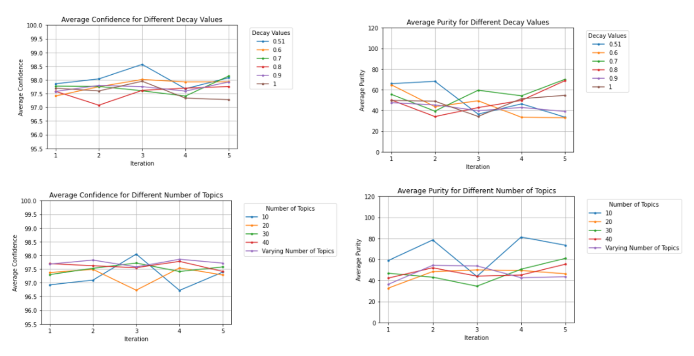

# Overview
This folder contains the visualization results of running our code and a short analysis of our results.
We are comparing our results to those in the Mining Causal Topics in Text Data: Iterative Topic Modeling with Time Series Feedback by Kim et al.

# Analysis of Results

## Topic Purity Analysis
The paper experimented with parameter mu which is to weight the word prior distribution by controlling the pseudo-counts. However, as gensim's LDA has effectively blackboxed the method, we instead experiment with the decay parameter as a similar alternative to mu. To test the decay parameter, we run LDA with 30 topics and decay values from (0.5, 1].

The paper found that higher levels of mu (we use the decay parameter provided in gensim's LDA implementation as a similar alternative) were not always associated with higher levels of purity in the topics and infact tend to see a decrease in topic purity. However, we find that the best decay parameter to use would be somewhere around 0.7 in this example. We see that at decay=0.7, 0.8, there seems to be a general increase in purity, while there is a general decrease for decay=0.51, 0.6, 0.9. Purity level for decay=1 seems to be relatively constant.

The paper also tried a number of different topics with mu=1000. We do a similar comparison by running LDA with k=10, 20, 30, 40, and a varying number of topics with the decay parameter set to 1. The paper did see a better increase of purity over the iteration with a varying number of topics and k=40. However, we see that by the end of the 5th iteration, k=10 was consistently much higher than the other k values. Varying the number of topics each iteration did not seem to improve the average purity of the causal topics we found.

## Causal Confidence Analysis
We found that most decay parameters did improve the causal confidence in our topics. While there was a slight bump in confidence at iteration 3 with decay=0.51, it immediate return back around 97.75% confidence. Only with decay=0.7, 0.8 was there a signifant increase in the confidence.

We see similar confidence results with different k parameters. Varying the topics each iteration did not seem to improve the confidence, but it did have a better confidence overall for most iterations. There was no number of topics that seemed to have an increasing confidence level.

# pyLDAVis
To see the pyLDAVis interactive visualization, go to [Github's HTML Preview](https://htmlpreview.github.io/) and copy paste the link to the html file. Note that the size of the bubble does not correspond to a higher probability of the topic appearing, it simply means more words were assigned to it. A good topic model will have less overlapping bubbles which corresponds to more distinct topics.
